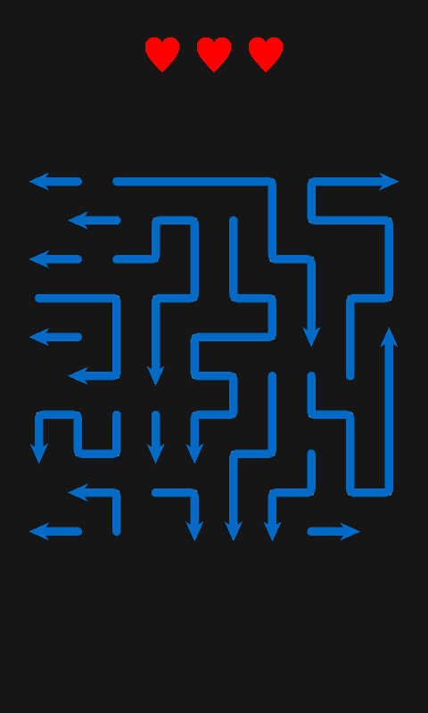
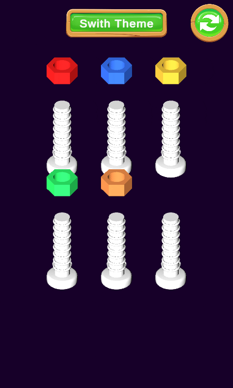

# Hybrid Casual Replica Study

A study in architecture and production practice built by replicating the mechanics of trending hybrid-casual mobile games.
Each replica keeps its game rules in a pure C# (Unity-free) layer, with Unity acting as a thin presentation shell.

| Replica | Mechanic | Scene | Gameplay |
|---|---|---|---|
| **Arrows** | Tap an arrow whose path is clear and it leaves the board. Tapping a blocked arrow costs a life (3 lives). Clear every arrow to win. | `Assets/Replicas/Arrows/ArrowsClone.unity` |  |
| **Magic Sort** | Color sorting: move the top same-color group onto an empty bar or a bar with the same top color. Two themes (Bolt / Tube), switchable mid-game. | `Assets/Replicas/MagicSort/SortReplica.unity` |  |

## Requirements

- Unity **6000.3.21f1**
- Packages: uGUI, Unity Test Framework, Performance Testing
- `Assets/Plugins`: DOTween (Demigiant), 2D Casual Game UI (Belevich)
- Input: Legacy Input Manager

## Architecture

Game logic lives in **Core** assemblies that do not depend on Unity. Core asmdefs are marked
`noEngineReferences: true`, so calling a Unity API from Core is a **compile error**.

```
Core     (pure C#)     rules, state, generation/validation, camera and input logic
  ▲
Runtime  (UnityEngine) MonoBehaviour adapters: prefabs, tweens, audio, camera, input reading
  ▲
Editor   (UnityEditor) level editor windows
Tests    (EditMode)    test Core; also look at Runtime for asset integrity
```

Rules (details in [`CLAUDE.md`](CLAUDE.md)):

- **MonoBehaviour = dumb adapter.** It only carries serialized data, forwards lifecycle to Core and calls Unity APIs.
- **Single composition root:** `ArrowsGameManager` / `MagicSortGameManager`. No singletons.
- **No work in `Update`:** the GameManager calls `TickGroup.Tick(dt)`; the ticked objects are Core `ITickable`s.
- **Everything non-deterministic sits behind an interface:** `IRandomSource`, `IInputSource`, `IViewport`, `IThemeCycle`.
- **Presentation connects to Core through an interface:** `IArrowsView` (Arrows), `ISortTheme` (Magic Sort).

### Assemblies

| Assembly | Folder | References |
|---|---|---|
| `ReplicaProjects.Common.Core` | `Common/Core` | — |
| `ReplicaProjects.Common` | `Common` (EndScreen) | uGUI |
| `ReplicaProjects.Common.Editor` | `Common/Editor` | — |
| `ReplicaProjects.Common.TestSupport` | `Common/TestSupport` | Test Framework |
| `ReplicaProjects.Arrows.Core` | `Arrows/Core` | Common.Core |
| `ReplicaProjects.Arrows` | `Arrows/Runtime` | Arrows.Core, Common, Common.Core |
| `ReplicaProjects.Arrows.Editor` | `Arrows/Editor` | Arrows, Arrows.Core, Common.Editor |
| `ReplicaProjects.MagicSort.Core` | `MagicSort/Core` | Common.Core |
| `ReplicaProjects.MagicSort` | `MagicSort/Runtime` | MagicSort.Core, Common, Common.Core |
| `ReplicaProjects.MagicSort.Editor` | `MagicSort/Editor` | MagicSort, MagicSort.Core, Common.Editor |
| `*.Tests` | `*/Tests` | matching Core (+ Runtime), TestSupport |

## Folder structure

Folders are grouped by domain concept, not by technical kind. Tests mirror the Core layout one to one.

```
Assets/Replicas/
  Common/
    Core/         IRandomSource, SeededRandomSource, ITickable, TickGroup, LevelCursor
    EndScreen/    EndScreenPresentation
    Editor/       LevelAssetBrowser<T>, EditorDraw
    TestSupport/  GcAllocCounter, AllocationAssert
    Tests/
  Arrows/
    Core/
      Board/      GridCoord, Direction, HeadData, BoardController, BoardOrchestrator, BoardGeometry
      Grid/       GridLogic, GridOrchestrator
      Generation/ LevelGenerator, LineGrower
      Validation/ BoardValidator, LineValidator, SolvabilityChecker, BoardRules
      Session/    ArrowsSession, HealthOrchestrator, ArrowTapResult, IArrowsView
      Controls/   TapDetector, CameraRig, CellPicker, IInputSource, IViewport
      Authoring/  LevelEditBuffer, LinePainter
    Runtime/      ArrowsGameManager, LevelData, Board/, Controls/
    Editor/       LevelEditorWindow and its parts
    Levels/       LevelData assets
  MagicSort/
    Core/
      Board/        MagicSortLogic, MagicSortOrchestrator, SequentialBarArrayInput, TapResult
      Presentation/ PresentationCore, ISortTheme, BarGridLayout, CompletionCounter
      Session/      MagicSortSession, IThemeCycle
      Authoring/    MagicSortSolver, MagicSortGenerator, LevelMetrics, Bar
    Runtime/      MagicSortGameManager, MagicSortLevel, Themes/, Bolt/, Tube/
    Editor/       MagicSortEditorWindow and its parts
    Levels/       MagicSortLevel assets
```

## Level editors

Open them from `Tools > Level Design`. Both work on a copy of the asset and write back only on a valid save.

- **Arrows Level Editor:** stamp arrow heads, paint lines, erase, generate random levels.
  Shortcuts: `W/A/S/D` direction, `L` line, `E` erase, `R` randomize, `C` clear.
  Saving validates the board: facing, line rules and solvability (deadlock check).
- **Magic Sort Level Editor:** free moves, scrambling (depth / fragmentation difficulty), and a BFS solver
  for the "can it be solved?" check and the minimum move count. Unsolvable layouts are not saved.
  How the solver works: [`BallSortSolver-BFS-Explained.md`](Assets/Replicas/MagicSort/BallSortSolver-BFS-Explained.md).

## Tests

All tests are EditMode. In Unity: `Window > General > Test Runner > EditMode > Run All`.

From the command line (with the Editor closed):

```bash
"<Unity 6000.3.21f1>/Editor/Unity.exe" -batchmode -projectPath . \
  -runTests -testPlatform EditMode -testResults results.xml -logFile test.log
```

Coverage:

- **Rules and state:** taps, pours, lives, win/lose, theme switching, selection.
- **Generation and validation:** the same seed produces the same level; generated levels are always solvable.
- **Controls:** tap vs. drag, camera fit, zoom and pan limits (with fake input/viewport).
- **Allocation:** steady-state zero GC allocations on per-frame and per-tap paths (`AllocationAssert`).
- **Asset integrity:** no missing scripts in prefabs, scenes or ScriptableObjects; shipped levels are valid and solvable.

Fakes are hand-written (`FakeInputSource`, `FakeViewport`, `FakeSortTheme`, `RecordingArrowsView`).
No mocking library is used.

## Adding a new replica

1. Under `Assets/Replicas/<Name>/`, create `Core` (`noEngineReferences: true`), `Runtime`, `Editor` and `Tests` asmdefs.
2. Write the rules in Core, tests first.
3. Connect presentation through an interface in Core. Keep a single `<Name>GameManager` composition root in Runtime.
4. When moving or renaming a script, move its `.meta` file too; `ReplicaAssetIntegrityTests` catches broken GUIDs.
